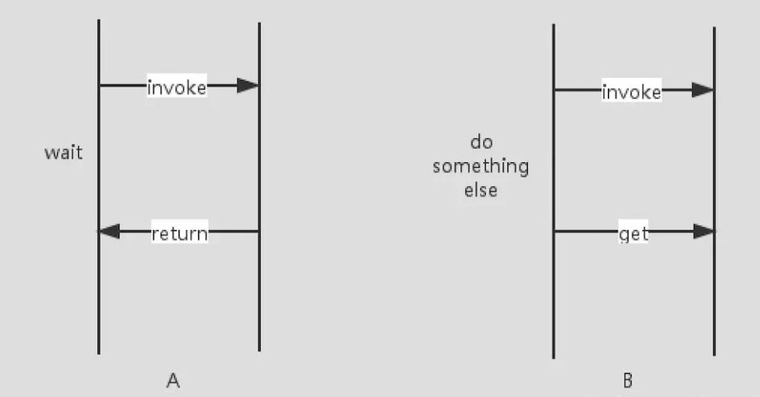

# 1. 信号signal

- 信号是用来完成模块或功能之间通信的媒介，其实就是约定了一些方法的回调形式

- 设计模式上叫做观察者设计模式

```
1. 观察者和被观察者是抽象耦合的，解耦模块 
2. 建立一套统一的触发机制
```

- Godot引擎官方建议在你的游戏开发中更多的使用信号来完成模块或功能间的通信

- 第一种使用方法

```
# 第一种信号接受方法，通过在场景中配置信号的接收方法
func _on_Button1_pressed():
	print("hello button1")
```

- 第二种使用方法

```
# 第二种信号接受方法，通过代码控制信号的接收，更加的灵活，比较推荐方式
func _ready():
	$Button2.connect("pressed", self, "onButton2")
	
func onButton2():
	print("button2 pressed")
```

# 2. 自定义信号

- 自定义信号

```
signal mySignal(a, b)
```

- 发送信号

```
emit_signal("mySignal", 1, 2)
```

- 解除绑定信号

```
disconnect("mySignal", 1, 2)
```

# 3. 异步回调yield

- yield, to produce a result, answer, or piece of information，立即结束当前函数调用，无需等待

```
其本质，就是能让一个函数在执行过程中暂停（挂起），然后在接收到恢复指令以后继续执行的机制。
```

- yield(obj, signal)，函数立即返回，并且保存当前执行的位置和状态

```
GDScriptFunctionState yield( Object object=null, String signal="" )
```

- yield返回GDScriptFunctionState类型对象，类似于Java的CompleteFuture

```
GDScriptFunctionState 是记录一个协程状态的对象，实际上它就代表(引用)着该协程。
```

- resume恢复GDScriptFunctionState保存的调用函数状态



- yield的三种用法
1. yield()和resmue()组合，yield()来挂起，用resmue()来恢复
2. yield(对象,信号S)的形式，把这个协程（即 GDScriptFunctionState）注册为 节点N上信号S的接收者，当 节点N发出信号S以后，函数会恢复执行。
3. yield(协程对象C,"completed")的形式，协程失效（即GDScriptFunctionState的is_valid为false）以后，它会释放一个"completed"信号，用这个信号恢复上一层协程。


# 4. 多线程

- 什么是进程？
```
电脑中有时会有很多单独运行的程序，每个程序有一个独立的进程，而进程之间是相互独立存在的。比如QQ、浏览器
```

- 什么是线程？
```
进程想要执行任务就需要依赖线程。换句话说，就是进程中的最小执行单位就是线程，并且一个进程中至少有一个线程。
```

- 那什么是多线程？提到多线程这里要说两个概念，就是串行和并行，搞清楚这个，我们才能更好地理解多线程。
- 串行，其实是相对于单条线程来执行多个任务来说的，比如下载一个文件要等到上一个文件下载完
- 并行，下载多个文件，开启多条线程，多个文件同时进行下载，这里是严格意义上的，在同一时刻发生的，并行在时间上是重叠的
